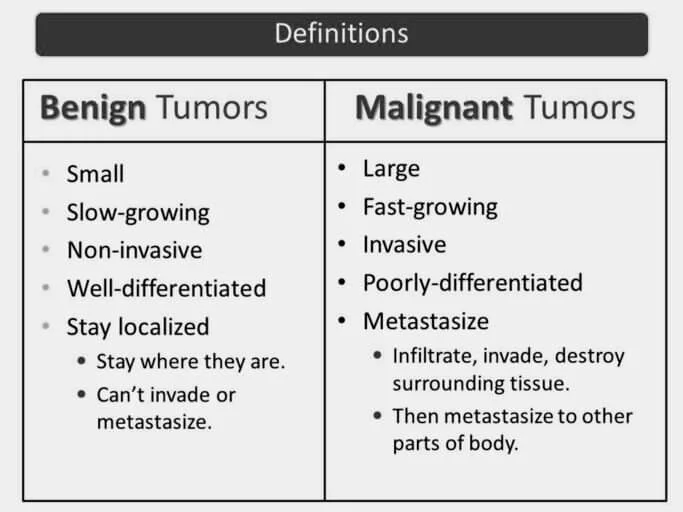
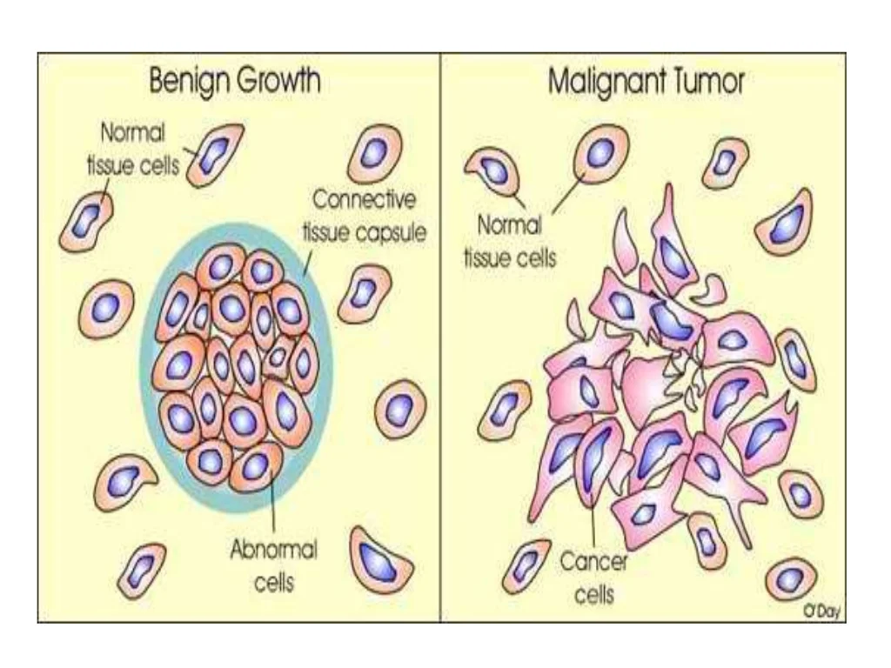
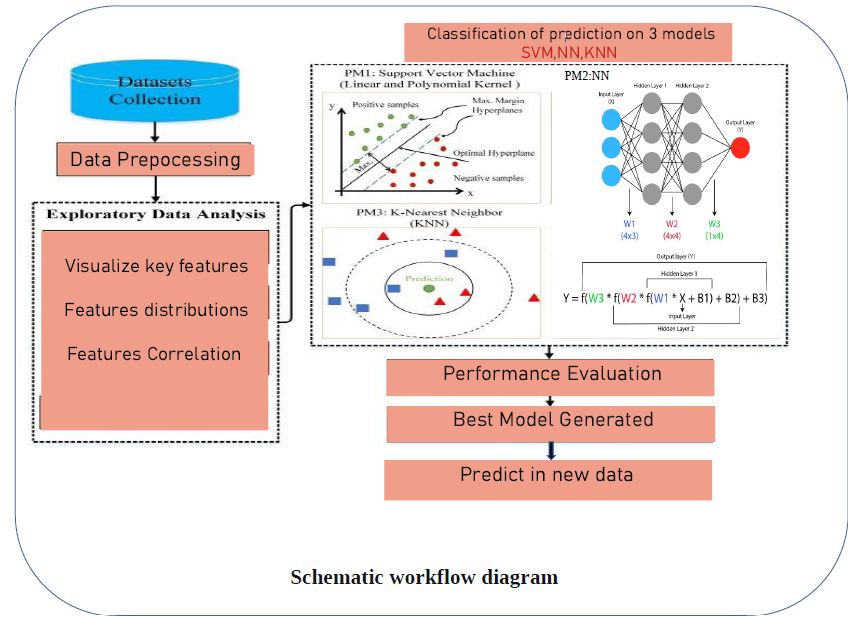
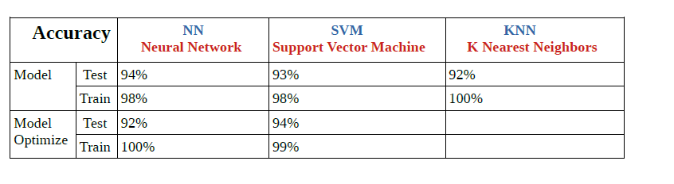
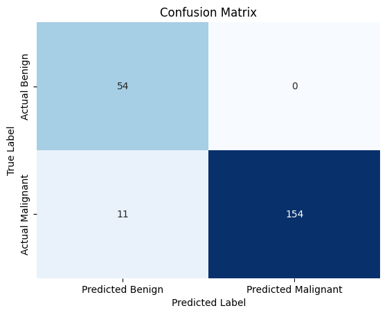

# Breast-Cancer-ML
Breast Cancer Classification & Prediction using Machine Learning Framework
## 

# Project Objective 
Generate a good machine Learning model that can be used to classify patient with Breast Cancer from any input preprocessing data (DET) .

# Why we choose this topic:

Breast cancer, affecting 2.2 million individuals annually, is the most prevalent cancer worldwide. Early 
diagnosis significantly improves survival rates, and a key challenge lies in distinguishing between benign and malignant tumors. 
Machine learning (ML) techniques have demonstrated the potential to dramatically enhance diagnostic accuracy, with research revealing a 97% success rate compared to 79% by experienced doctors.
By integrating advanced computational models, we seek to  achieve early and highly accurate diagnosis of breast cancer patients, thereby reducing waiting times and minimizing human and technical errors in the diagnostic process. This predictive model aims to assist doctors in efficiently diagnosing breast cancer and enable patients to receive early treatment.

 ### General Description
Breast cancer is a cancer that develops from breast tissue. Signs of breast cancer may include a lump in the breast, a change in breast shape, dimpling of the skin, milk rejection, fluid coming from the nipple, a newly inverted nipple, or a red or scaly patch of skin ====for more information you can visit this health links https://en.wikipedia.org/wiki/Breast_cance
  

### Analyse breast tumours by Machine Learning 
Our workflow ensures an approach to breast tumor analysis, from data collection to deploying a predictive model for real-time predictions on new data. We divided on 7 steps :

    ###  1- Dataset Collection  
         2- Data Preprocessing  DP
         3-Exploratory Data Analysis  EDA
         4-Classification of prediction on 3 models SVM,NN,KNN
         5-Performance Evaluation  
         6-Best Model Generated 
         7-Predict on new Data 
  #### Schematic workflow diagram

### Flow Implementation 
    The implementation is doing on the code bellow and it s deeply explained 
https://github.com/fahr-khadija/Breast-Cancer-ML
### Results Analysis And Decision
In our work , we used NN, SVM, and KNN three machine learning techniques to early prevention and detection of breast cancer to find which method performs better that we can used to predict the new data. 

  #### 1-Analyze the performance and evaluation 
 Tableau for accuracy 

  
   #### • Machines learning techniques performance 

   ####  Neural Network (NN):
         -------------------------------------------------------------------------------
         Results
        Before Optimization:
        Test Set:        Accuracy: 94.32%,Loss: 0.1303
        Training Set: Accuracy: 98.47% ,Loss: 0.0669
        After Optimization:
        Test Set:       Accuracy: 92.05%,Loss: 0.3176
        Training Set: Accuracy: 100.00%,Loss: 0.0026
        ********
     Analysis:
     The neural network performs well on the test and training sets before optimization.
     After optimization, there's a decrease in test accuracy, indicating potential overfitting during optimization. 
     However, the training accuracy reaches 100%, suggesting the model might be overfitting to the training data.
-------------------------------------------------------------------------------
 
 ####  Support Vector Machine (SVM):
       Before Optimization:
       Test Set:        Accuracy: 93.18%
       Training Set: Accuracy: 98.47%
       After Optimization:
       Test Set:        Accuracy: 94.32%
      Training Set: Accuracy: 99.24%
     ********
    Analysis:
    The SVM performs well on both the test and training sets.
    Optimization results in a slight increase in test accuracy, indicating improvement.
    So we can use the optimized model to predict the new Data 

 ####  K Nearest Neighbors (KNN):
        Test Set:Precision: 92%,Recall: 92%,F1-score: 92%,Accuracy: 92%
        Training Set:Precision: 100%,Recall: 100%,F1-score: 100%,Accuracy: 100%
        ********
       Analysis:
       KNN performs well on both the test and training sets, achieving high precision, recall, and accuracy.
   
#### • Machines learning techniques evaluation 
Neural Network (NN) consider the potential overfitting after optimization.we should evaluate 
 other metrics and consider tuning hyperparameters to improve it .
Support Vector Machine (SVM) appears to be a strong performer, especially after optimization.
The model's accuracy on the test and training sets is relatively high.
K Nearest Neighbors (KNN) performs consistently well, showing high precision, recall, and accuracy.  

   #### -Decision:
SVM and KNN both demonstrate strong performance, but SVM exhibits superior accuracy on both the test and training sets. 
Therefore, we have chosen the optimized SVM model for predicting in the new dataset. 

## • Predict on new Data Analyze
      
      Applying the trained model to real-world cases for diagnosis and decision-making.  
      New dataset =Breast_cancer_new
      
   ###  Accuracy on new dataset: 0.9497716894977168 
   

        
            ####    Our analytics indicate that our model performs well with the new dataset,       achieving a commendable accuracy of approximately 95%. However, a notable concern arises when examining the confusion matrix, revealing 11 instances in which the model produces both true positives and true negatives. This situation implies that the model fails to identify cases where cancer is present or incorrectly predicts the absence of cancer. Given the critical nature of this issue and its potential impact on patient outcomes, it is imperative to optimize our model further to mitigate and minimize such occurrences

